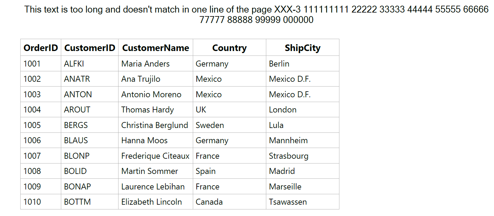

# How to Display the Wrapped HeaderTemplate Text in Exported PDF File in WPF DataGrid?

This sample illustrates how to display the wrapped HeaderTemplate text in exported PDF file in [WPF DataGrid](https://www.syncfusion.com/wpf-controls/datagrid) (SfDataGrid).

In `DataGrid`, you can wrap the header in exported PDF document by setting [WordWrap](https://help.syncfusion.com/cr/wpf/Syncfusion.Pdf.Graphics.PdfStringFormat.html#Syncfusion_Pdf_Graphics_PdfStringFormat_WordWrap) property in [PdfStringFormat](https://help.syncfusion.com/cr/wpf/Syncfusion.Pdf.Graphics.PdfStringFormat.html) class and apply the format to the [PdfPageTemplateElement](https://help.syncfusion.com/cr/wpf/Syncfusion.Pdf.PdfPageTemplateElement.html) using [PdfHeaderFooterEventHandler](https://help.syncfusion.com/cr/wpf/Syncfusion.UI.Xaml.Grid.Converter.PdfHeaderFooterEventHandler.html).

#### C#
```c#
private void Export_Click(object sender, RoutedEventArgs e)
{
    PdfExportingOptions options = new PdfExportingOptions();
    options.PageHeaderFooterEventHandler = PdfHeaderFooterEventHandler;
    var document = dataGrid.ExportToPdf(options);
    document.Save("Sample.pdf");
}

static void PdfHeaderFooterEventHandler(object sender, PdfHeaderFooterEventArgs e)
{
    var document = new PdfDocument();
    var page = document.Pages.Add();
    PdfPageTemplateElement header = new PdfPageTemplateElement(page.Graphics.ClientSize.Width, 38);
    var _headerFont = new PdfTrueTypeFont(new Font("Microsoft Sans Serif", 10f), true);
    var _blackBrush = new PdfSolidBrush(System.Drawing.Color.Black);
    PdfStringFormat format = new PdfStringFormat();
    format.Alignment = PdfTextAlignment.Center;
    format.WordWrap = PdfWordWrapType.Word;
    string title = "This text is too long and doesn't match in one line of the page XXX-3 111111111 22222 33333 44444 55555 66666 77777 88888 99999 000000";
    //Draw title
    header.Graphics.DrawString(title, _headerFont, _blackBrush, new RectangleF(0, 0, header.Width, header.Height), format);           
    e.PdfDocumentTemplate.Top = header;
}
```



## Requirements to run the demo
 Visual Studio 2015 and above versions